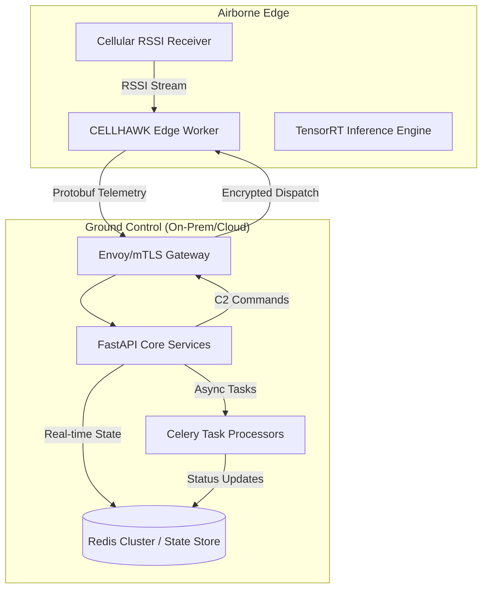

# CELLHAWK | Architecture Deep Dive
**Proprietary Technical Overview for Strategic Partners**

---

## 1. System Architecture Overview
CELLHAWK is a software-defined autonomy stack designed for high-availability mission control in contested environments. The system utilizes a distributed, event-driven architecture optimized for low-latency command dispatch and resilient telemetry processing.

### High-Level Component Diagram

## 2. Component Breakdown

### A. Connectivity & Security (mTLS)
The system enforces **Mutual TLS (mTLS)** for all airborne-to-ground communication.
- **Handshake:** Handled by an upstream Envoy or Nginx proxy.
- **Enforcement:** Middleware validates `X-SSL-Client-Verify` and `X-SSL-Client-Subject-DN` headers.
- **Resilience:** SITL (Software-in-the-Loop) ingest bypasses are strictly environment-guarded to prevent production exposure.

### B. State Orchestration & Spatial Indexing (Redis)
All aircraft state (position, health, swarm role) is maintained in a high-performance Redis cluster.
- **Latency:** Sub-millisecond state lookups using optimized data structures.
- **Geospatial Correlation:** Utilizes Redis **GEO spatial indexing** for real-time correlation of drone telemetry with cellular tower databases within a 500m precision radius.
- **AI State Hydration:** Per-drone AI state (DeepSORT trackers, Behavioral models) is hydrated/dehydrated from Redis using a Synchronous-to-Async pattern to minimize memory overhead.

### C. Processing Pipeline (Celery & AI Workers)
The system employs a distributed worker model for heavy computation.
- **Dual-Write Pattern:** Threats are simultaneously published to a Pub/Sub channel (for sub-50ms WebSocket UI updates) and a persisted Redis LIST (for reliable REST polling).
- **Memory Protection:** Automatic list capping (LTRIM) and exponential backoff retries ensure system stability during high-intensity EW scenarios.
- **Positioning Engine (Multilateration):** Converts raw RSSI signals from multiple towers into geographic coordinates using a Weighted Least Squares (TRF) method.

---

## 3. API Summary (V1)

| Endpoint | Method | Purpose |
| :--- | :--- | :--- |
| `/api/v1/aircraft` | GET | Retrieve global fleet status and health metrics. |
| `/api/v1/missions` | POST | Deploy swarm-wide mission parameters and geofences. |
| `/api/v1/ingest` | POST | High-frequency telemetry ingest (Protobuf/JSON). |
| `/api/v1/security` | GET | Real-time audit of active mTLS certificates and node access. |
| `/api/v1/towers` | GET/POST | Manage regional cellular tower databases for multilateration. |

---
*Proprietary Architecture & Intellectual Property. © 2026 Shashank Kumar.*
